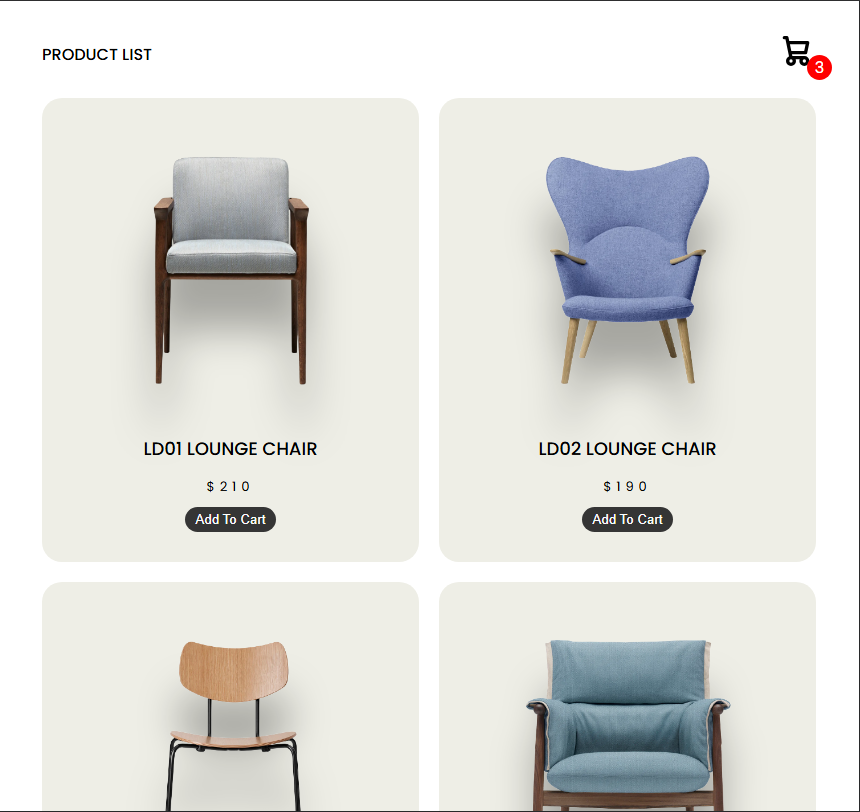
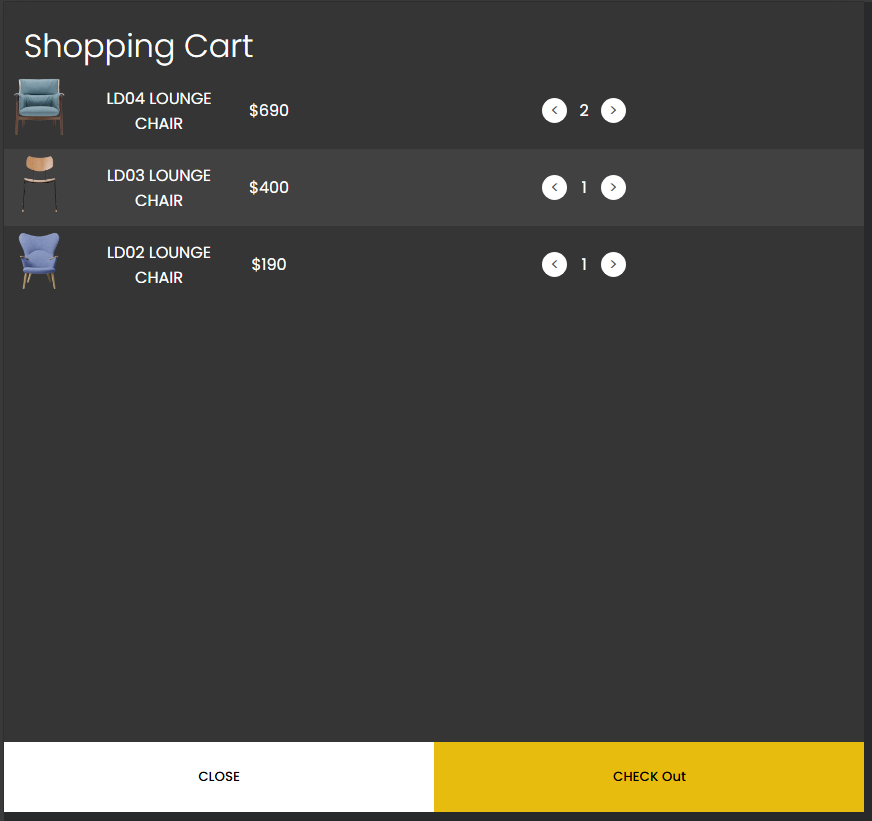

# 🛒 Shopping Cart

Bem-vindo ao **Shopping Cart**!  
Um projeto de carrinho de compras moderno, responsivo e totalmente funcional, desenvolvido com **HTML**, **CSS** e **JavaScript**.



---

## ✨ Funcionalidades

- **Listagem de Produtos:**  
  Exibe uma lista dinâmica de produtos, carregados a partir de um arquivo JSON.

- **Adicionar ao Carrinho:**  
  Adicione produtos ao carrinho com apenas um clique.

- **Visualização do Carrinho:**  
  Veja todos os itens adicionados, com imagem, nome, quantidade e preço total.

- **Alteração de Quantidade:**  
  Aumente ou diminua a quantidade de cada produto diretamente no carrinho.

- **Remoção de Itens:**  
  Remova produtos do carrinho ao reduzir a quantidade para zero.

- **Contador de Itens:**  
  O ícone do carrinho exibe em tempo real o número total de itens.

- **Persistência com Local Storage:**  
  O carrinho é salvo automaticamente no navegador, mesmo após recarregar a página.

- **Design Responsivo:**  
  Layout adaptável para desktop, tablet e mobile.

---

## 🖥️ Demonstração



---

## 🚀 Como Usar

1. **Clone o repositório:**
   ```sh
   git clone https://github.com/MarcosVogado/shopping_cart.git
   ```

2. **Navegue até a pasta do projeto:**
   ```sh
   cd shopping_cart
   ```

3. **Abra o arquivo `index.html` em seu navegador.**

---

## 📚 Tecnologias Usadas

- **HTML5**
- **CSS3**
- **JavaScript (ES6+)**
- **JSON**

---

## 🤝 Contribuições

Contribuições são bem-vindas! Sinta-se à vontade para enviar um pull request.

---

## 📝 Licença

Este projeto está licenciado sob a licença MIT. Veja o arquivo `LICENSE` para mais detalhes.

---

## 👤 Autor

**Marcos H C Vogado** - [MarcosVogado](https://github.com/MarcosVogado)


